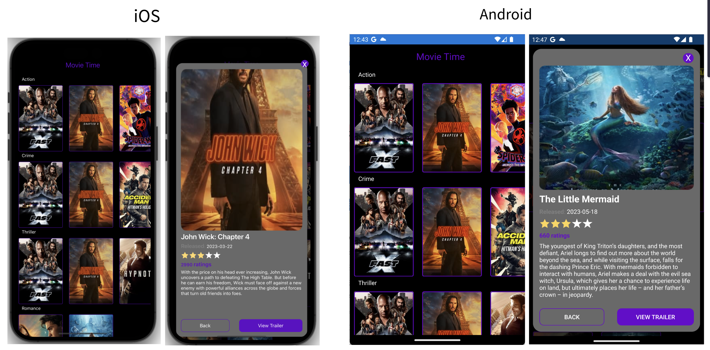

# MovieAppSample

To test, replace the value in the **ApiKey** property in Config.cs with a valid api key

## Third-parties Libraries used
- **[FFImageLoading](https://github.com/luberda-molinet/FFImageLoading)** - Library to load images quickly & easily on Xamarin.iOS, Xamarin.Android, Xamarin.Forms, Xamarin.Mac / Xamarin.Tizen and Windows (UWP, WinRT)

- **[PropertyChanged.Fody](https://github.com/Fody/PropertyChanged)** - Handles property changed events.      

- **[Prism](https://github.com/PrismLibrary/Prism)** - Framework for building loosely coupled, maintainable, and testable XAML applications in WPF, Xamarin Forms, Uno Platform and WinUI.

- **[Prism.Plugin.Popups](https://github.com/dansiegel/Prism.Plugin.Popups)** - The Popups plugin provides an extremely lightweight framework for implementing Popup Pages using the Rg.Plugin.Popup package with Prism.Forms.
                                                    
- **[Refit](https://github.com/reactiveui/refit)** - Refit is a library heavily inspired by Square's Retrofit library, and it turns your REST API into a live interface.
                                  
